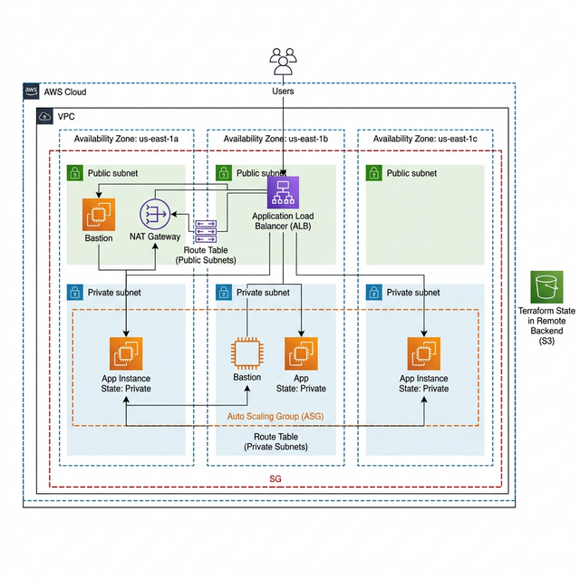

# AWS Multi-AZ Infrastructure — Terraform

Production-grade AWS infrastructure provisioned with Terraform. Deploys a highly available setup across 3 Availability Zones with an Application Load Balancer, Auto Scaling Group, and private EC2 instances running nginx. Remote state is stored in S3.

## Architecture



| Component | Detail |
|---|---|
| **VPC** | `10.0.0.0/16` across 3 AZs |
| **Subnets** | 3 public (ALB) + 3 private (EC2) |
| **Load Balancer** | Internet-facing ALB, HTTP listener |
| **EC2 Instances** | Ubuntu 22.04, private subnets, nginx |
| **Auto Scaling** | CPU target tracking, min 1 → max 3 |
| **NAT Gateway** | Single NAT GW in us-east-1a (cost saving) |
| **Remote State** | S3 + native S3 lock file |
| **Security** | IMDSv2, encrypted EBS, least-privilege SGs |

---

## Prerequisites

- [Terraform](https://developer.hashicorp.com/terraform/downloads) >= 1.10
- [AWS CLI](https://aws.amazon.com/cli/) v2
- AWS account with IAM permissions for EC2, VPC, ALB, ASG, IAM, S3

---

## 1. Configure AWS Credentials

```bash
aws configure
```

Enter your:
- AWS Access Key ID
- AWS Secret Access Key
- Default region: `us-east-1`
- Output format: `json`

Verify it works:
```bash
aws sts get-caller-identity
```

---

## 2. Set Up S3 Remote State Backend

### Create the S3 bucket

> Bucket names are globally unique — replace `your-name` with something unique.

```powershell
aws s3api create-bucket --bucket your-name-terraform-state --region us-east-1
```

### Enable versioning (lets you recover previous state)

```powershell
aws s3api put-bucket-versioning `
  --bucket your-name-terraform-state `
  --versioning-configuration Status=Enabled
```

### Enable server-side encryption

```powershell
aws s3api put-bucket-encryption `
  --bucket your-name-terraform-state `
  --server-side-encryption-configuration '{\"Rules\":[{\"ApplyServerSideEncryptionByDefault\":{\"SSEAlgorithm\":\"AES256\"}}]}'
```

### Block all public access

```powershell
aws s3api put-public-access-block `
  --bucket your-name-terraform-state `
  --public-access-block-configuration "BlockPublicAcls=true,IgnorePublicAcls=true,BlockPublicPolicy=true,RestrictPublicBuckets=true"
```

### IAM permissions required

The AWS user/role running Terraform needs these S3 permissions on the bucket:

```json
{
  "Effect": "Allow",
  "Action": [
    "s3:GetObject",
    "s3:PutObject",
    "s3:DeleteObject",
    "s3:ListBucket"
  ],
  "Resource": [
    "arn:aws:s3:::your-name-terraform-state",
    "arn:aws:s3:::your-name-terraform-state/*"
  ]
}
```

### Update providers.tf

Edit the `backend "s3"` block in `providers.tf`:

```hcl
backend "s3" {
  bucket       = "your-name-terraform-state"   # ← your bucket name
  key          = "production/terraform.tfstate"
  region       = "us-east-1"
  encrypt      = true
  use_lockfile = true
}
```

---

## 3. Configure Variables

Edit `terraform.tfvars`:

```hcl
aws_region   = "us-east-1"
project_name = "myapp"
environment  = "production"

# Networking
vpc_cidr             = "10.0.0.0/16"
availability_zones   = ["us-east-1a", "us-east-1b", "us-east-1c"]
public_subnet_cidrs  = ["10.0.1.0/24", "10.0.2.0/24", "10.0.3.0/24"]
private_subnet_cidrs = ["10.0.11.0/24", "10.0.12.0/24", "10.0.13.0/24"]

# Compute
ami_id        = "ami-0261755bbcb8c4a84"  # Ubuntu 22.04 LTS (us-east-1)
instance_type = "t3.micro"
key_name      = ""  # Set to your EC2 Key Pair name for SSH

# Auto Scaling
asg_min_size           = 1
asg_max_size           = 3
asg_desired_capacity   = 1
cpu_target_utilization = 60
```

---

## 4. Deploy

```bash
# Download providers and configure the S3 backend
terraform init

# Preview all resources that will be created (~26 resources)
terraform plan

# Deploy (type 'yes' when prompted — takes ~5 min)
terraform apply
```

Get the ALB URL after apply:
```bash
terraform output alb_url
```

Open the URL in your browser — you should see the nginx welcome page.

---

## 5. Verify Load Balancing

**PowerShell:**
```powershell
$url = terraform output -raw alb_dns_name
1..15 | % { (Invoke-RestMethod "http://$url/api/status") | Select-Object private_ip, instance_id, az }
```

**Bash / Git Bash:**
```bash
url=$(terraform output -raw alb_dns_name)
for i in $(seq 1 15); do
  curl -s "http://$url/api/status" | python3 -c "import sys,json; d=json.load(sys.stdin); print(d['private_ip'], d['instance_id'], d['az'])"
done
```

Repeated calls should show different `private_ip` / `instance_id` values, confirming the ALB is distributing traffic.

---

## 6. Test Autoscaling

Connect to an instance via **AWS Systems Manager → Session Manager** and run:

```bash
stress-ng --cpu 0 --cpu-load 80 --timeout 600
```

After ~3 minutes of sustained CPU above 60%, the ASG will launch additional instances. Monitor in:
- **EC2 → Auto Scaling Groups → Activity tab**
- **EC2 → Target Groups → Targets tab**

Scaling back in happens automatically after ~15 minutes of low CPU.

---

## 7. Verify Remote State

After `terraform apply`, confirm state is stored in S3:

```powershell
aws s3 ls s3://your-name-terraform-state/production/
```

Expected output:
```
terraform.tfstate
```

---

## 8. Destroy

```bash
terraform destroy
```

> ⚠️ This deletes all resources including the NAT Gateway and Elastic IP. The S3 state bucket is **not** deleted — do that manually if needed.

---

## Project Structure

```
terraform-aws-infra/
├── main.tf               # Wires all modules together
├── variables.tf          # Input variable definitions
├── outputs.tf            # Output values and test commands
├── providers.tf          # AWS provider + S3 backend config
├── terraform.tfvars      # Your variable values (update before deploying)
├── architecture.png      # Architecture diagram
└── modules/
    ├── vpc/              # VPC, subnets, IGW, NAT GW, route tables
    ├── security_groups/  # SGs for ALB and EC2 instances
    ├── alb/              # ALB, target group, HTTP listener
    ├── ec2/              # IAM role, launch template, user data
    └── autoscaling/      # ASG + CPU target tracking policy
```

---

## Variables Reference

| Variable | Description | Default |
|---|---|---|
| `aws_region` | AWS region | `us-east-1` |
| `project_name` | Resource name prefix | `myapp` |
| `environment` | Environment label | `production` |
| `vpc_cidr` | VPC CIDR block | `10.0.0.0/16` |
| `ami_id` | EC2 AMI (Ubuntu 22.04) | us-east-1 AMI |
| `instance_type` | EC2 instance type | `t3.micro` |
| `key_name` | EC2 Key Pair for SSH | `""` (disabled) |
| `asg_min_size` | ASG minimum instances | `1` |
| `asg_max_size` | ASG maximum instances | `3` |
| `asg_desired_capacity` | ASG desired instances | `1` |
| `cpu_target_utilization` | CPU % to trigger scale-out | `60` |

---

## Design Decisions

- **Single NAT Gateway** — saves ~$64/month vs one per AZ. For production HA, set `count = length(var.availability_zones)` in `modules/vpc/main.tf`.
- **ELB health check type on ASG** — ASG terminates instances the ALB marks unhealthy, not just OS failures.
- **`depends_on = [module.vpc]`** on the autoscaling module — ensures the NAT Gateway is fully ready before the first instance launches, so user data runs successfully.
- **IMDSv2 enforced** — prevents SSRF attacks from accessing instance metadata.
- **EBS encryption** — all volumes encrypted at rest with AES256.
- **S3 native locking (`use_lockfile`)** — replaces the older DynamoDB lock table approach, no extra infrastructure needed.
